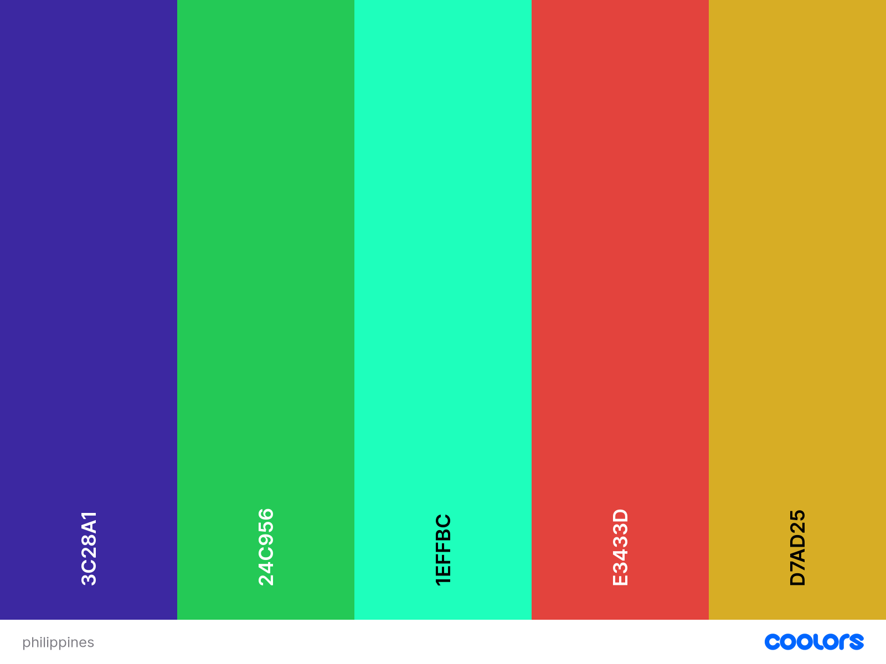
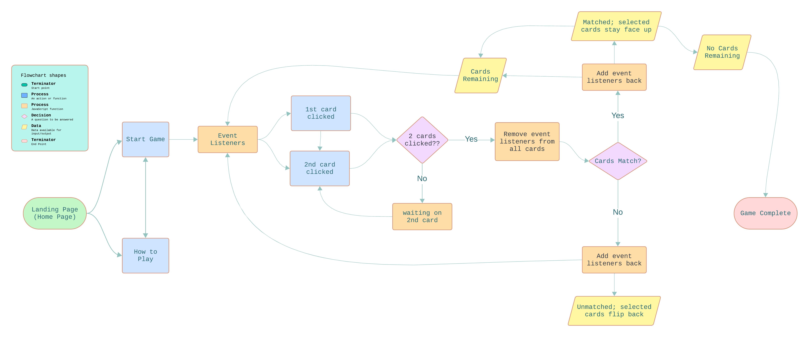

# Magkapares

Magkapares is the Tagalog (Filipino) equivalent of the word "Pairs". This project was inspired by my own learning of the Tagalog language. I wanted to create an interactive learning game based on the memory card game. 
This game will exercise memory and recollection, all the while learning a new language. It is suitable for children and adults alike. 
The website acts as a stepping stone to learning more about the Phillippines, in a fun way through learning a language.

## Table of Contents

* [Features](Features)
* 

---

## User Stories

### External user’s goal:

- Play a memorization game.
- Learn a language.
- Entertainment.

### Site owner's goal:

The site’s goal is to provide a fun and beginner friendly learning/memorization game.

---

## Features 

In this section, you should go over the different parts of your project, and describe each in a sentence or so. You will need to explain what value each of the features provides for the user, focusing on who this website is for, what it is that they want to achieve and how your project is the best way to help them achieve these things.

### Existing Features

- Cards are shown face down upon starting the game. 
- When you click on the first card, a hidden image reveals itself.
- When you click on another card, it matches and disappears, removing it as a selection option.
- When you choose a card that doesn't match, the cards return to their original facedown position.
- The game is complete when all the cards have matched.

### Future Features

#### Visuals
- Enhance assets such as images, with clearer visuals and wording.
- When you hover on the title "Magkapares", the heading flips around/fades into the English version of the word, "Pairs".
- You can click the information [i] icon that creates a pop-up window when you click on it of how to play the game.

#### Audio
- Sound effects to match the pronounciation of the words revealed. 

#### Gameplay
- Create different levels within the game so that the user can progress and advance their memory/learning skills. 
- A countdown timer that counts back from a set time limit.
- A pop-up banner that states if the user has won when all the cards have matched or if they have run out of time before getting the chance.
- A reset button so the player can play again.

---

## Design

### Colour Scheme

The colour scheme of the website was inspired by the tropical and rich colours of the Phillippines. They can be found in their coastlines, dense forests and colourful foods. 
Many of the colours chosen reflect many of those seen in the Philippines as a place and its culture. 

### Typography

Both fonts were sourced from [Google Fonts](https://fonts.google.com/).

- Patrick Hand SC

  - This has an illustration-type quality to it, which reflects the theme of the website. It adds some fun, and reflects the overall feel of the page.

- Quicksand
  - This is a legible font with many varieties of weight to choose from. It is versatile and accomodates all structural styling needs. It is a very accessible font, and easy to read.

### Imagery

All card-images created using [Canva](https://www.canva.com/)

### Favicon

The favicon is rectangular-shaped (card), with a black question mark and bright pink background to ensure that it stands out when other tabs are open.

### Flowchart

I used a flowchart to illustrate some of the main logical points before I began to code.

---

## Technologies Used

### Languages Used

HTML, CSS, JavaScript.

### Frameworks, Libraries & Programs Used

- [GitHub](https://github.com/)
- [Google Fonts](https://fonts.google.com/)
- [Font Awesome](https://fontawesome.com/)
- [Canva](https://www.canva.com/)
- [Favicon.io](https://favicon.io/favicon-converter/)
- [Coolors](https://coolors.co/)
- [Lucidchart](https://www.lucidchart.com/pages)
- VS Code
 
 Any specific uses to the following webpages can be found within their relative subtitle of application.

 ---

## Deployment

The site was deployed early using Github Pages. The is how the live site was deployed:

1. Log in (or sign up) to Github.
2. Find the repository for this project, Kate McGuane / magkapares.
3. Click on the Settings link.
4. Click on the Pages link in the left hand side navigation bar.
5. In the Source section (Build & Deployment), deploy from a branch.
6. In the Branch section (Build & Deployment), choose main from the Select Branch drop down menu. Choose Root from the Select Folder drop down menu.
7. Click Save. Your live Github Pages site is now deployed at the URL shown.
8. Follow up:
  * Go to repository home of website.
  * Click 'Environments' in the right-hand-side panel.
  * Click 'View deployment'.

The live link can be found here - https://katemcguane.github.io/magkapares/

---

## Testing 

I used Chrome Devleoper Tools to assist in the testing process throughout the project. It helped me identify any errors I was making and refine the code I had created, most notably while logging to the console for JavaScript. 

### Validator Testing

#### HTML

[HTML Testing](documentation/magkapares_validator_w3.png)

#### CSS

[CSS Testing](documentation/magkapares_css%20validator_w3.png)

#### JavaScript

[JavaScript Testing pt1](documentation/magkapares_jshint_pt1.PNG)
[JavaScript Testing pt2](documentation/magkapares_jshint_pt2.PNG)

### Accessibility & Performance

Lighthouse in DevTools indicated that the website was performing relatively well. Improvements can be incorporated to future versions.

[Lighthouse Testing](documentation/magkapares_lighthouse_testing.png)

### Known Bugs

1. When the second card is clicked on the game, it does not display the image unless they are a matching pair. This will be resolved in future versions. For now, an alert will pop up to say that the pairs do not match, so the user is still aware that it is a mis-match.
2. The styling for when the cards are clicked is slightly off and needs to be fixed (this was the only error until my final review, see point 3).
3. I missed a bug that I created at some point while adding my final CSS. I did not have enough time to rectify this bug. It shows up when the pairs match, the card containers take up the entire screen.
4. The reset button does not have any functionality incorported; the JavaScript code needs to be written for it. I ran out time before I could add it in, and did not want to compromise the game with additional bugs.

---

## Credits 

### Resources

#### Code

* Copied some of the code from my own Project 1, [Hobby](https://github.com/KateMcGuane/hobby), and modified to suit the needs of this project.
* Used my mentors project as a guide towards my own project. Referenced throughout where code was used [Github](https://github.com/IuliiaKonovalova/flash_cards/tree/main).
* Stackoverflow [How to randomize (shuffle) a JavaScript array?](https://stackoverflow.com/questions/2450954/how-to-randomize-shuffle-a-javascript-array)

#### MarkUp
Referred to structures and resources used by CI Students & Github markup:
* [Student README: Bully Book Club](https://github.com/kera-cudmore/Bully-Book-Club/blob/main/README.md)
* [Student README: My To Do List](https://github.com/luandretta/my-to-do-list/tree/main)
* [Mentor README: Yingwen](https://github.com/IuliiaKonovalova/flash_cards/tree/main)

#### Code Institute
* Referred back to the Love Running Walkthrough project as a general guide when constructing HTML & CSS.

### Acknowledgements
- To Sarah, thank you so much for your time, energy and commitment to helping me understand a bit better, and helping me set up my VS Code workspace. I am positive that all those growing pains will pay off in the near future.
- Thank you to my mentor, Juliia, who managed to fit a super-human amount into our sessions. Your guidance, patience and empathy kept me going.
- Thank you to my partner Mikhail, for your support and nourishing meals. 
---
Developed by Kate McGuane for Code Institute Portfolio Project 2, 2024