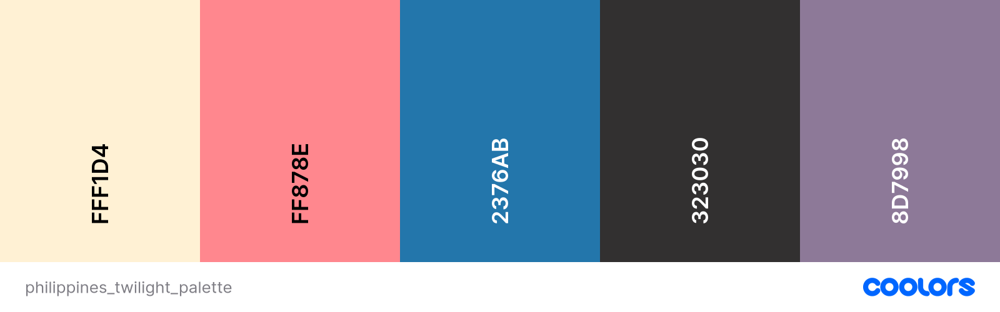
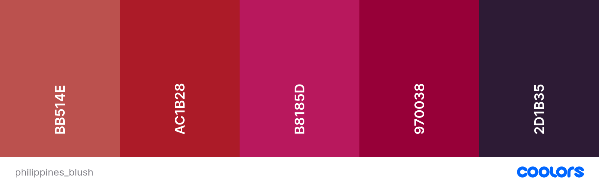
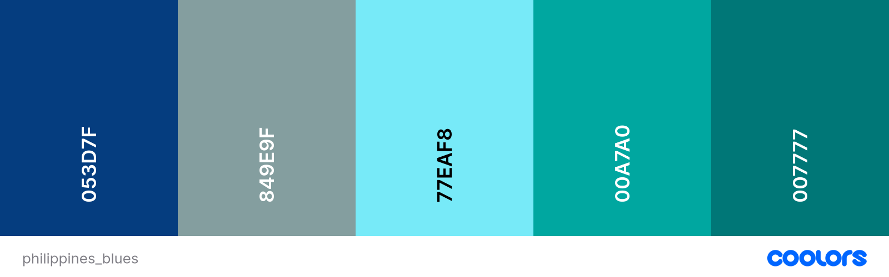
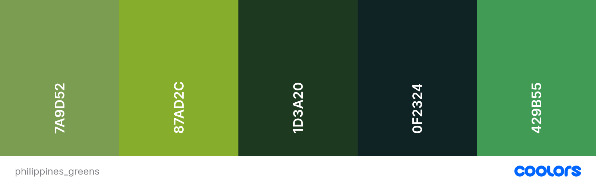

# *Magkapares*

Magkapares is the Tagalog (Filipino) equivalent of the word "Pairs". This project was inspired by my own learning of the Tagalog language. I wanted to create an interactive learning game based on the classic memory card game.
This game will exercise memory and recollection, all the while learning a new language. It is suitable for children and adults alike.
The website acts as a stepping stone to learning more about the Phillippines, in a fun way through learning a language.

[View Magkapares here](https://katemcguane.github.io/magkapares/)

---

## User Stories

### External user’s goal:

- Play a memorisation game
- Learn a language
- Entertainment

### Site owner's goal:

The site’s goal is to provide a fun and beginner friendly learning/memorisation game.

---

## Design

### Colour Scheme

The colour scheme of the website was inspired by the tropical and rich colours of the Phillippines. They can be found in their coastlines, dense forests and colourful foods.
Many of the colours chosen reflect many of those seen in the Philippines as a place and its culture. The colours below were extracted from the background beach image and the twilight sky seascape (both can be found in the images directory).

### Typography

Both fonts were sourced from [Google Fonts](https://fonts.google.com/).

- Patrick Hand SC

  - This has an illustration-type quality to it, which reflects the theme of the website. It adds some fun, and reflects the overall feel of the page.

- Quicksand
  - This is a legible font with many varieties of weight to choose from. It is versatile and accomodates all structural styling needs. It is a very accessible font, and easy to read.

### Imagery

All card-images created using [Canva](https://www.canva.com/).

### Favicon

The favicon is rectangular-shaped (card), with a black question mark and bright pink background to ensure that it is identifiable when other tabs are open.

### Flowchart

I used a flowchart to illustrate some of the main logical points before I began to code.

---

## Features

### Existing Features

  | Feature | | Screenshots |
  | --- | --- | --- |
  | Visuals | <ul><li>When you click the information [i] icon, a modal appears with a set of instructions on how to play the game.</li></li><li>Upon game completion, a modal appears. This states <ol type="a"><li>**WIN** - if all pairs are found before the timer runs out</li>*or*<li>**LOSS** - if the timer runs out before all pairs are found.</li></ol><li>A reset button on the game completion modal so the player can play again.</li></ul>|
  | Game Algorithm | <ul><li>Cards are shown face down upon starting the game.</li><li>When you click on the first card, a hidden image reveals itself.</li><li>When you click on second card, a hidden image reveals itself. <li>If the cards: <ol type="a"><li>**match** - the illustration changes, allowing no further selections be made to the paired cards. A score is added to the scoreboard for every pair matched.</li>*or*<li>**don't match**, the cards flip back to their original position. The gamescore remains unchanged.</li></ol></li><li>The game is complete when all the cards have matched.</li></ul> |
  | Timer & Score System | <ul><li>A countdown timer that counts back from a set time limit. When the timer runs out the game is over.</li></ul> |

### Future Gameplay Features

  | Feature |  |  |
  | --- | --- | --- |
  | Visuals |  | <ul><li>When you hover on the title, "Magkapares", the word transitions into the English version of the word, "Pairs".</li></ul>|
  | UX | Audio | <ul><li>When a card is revealed, it pronounces the word written on the card.</li><li>Audio cues for matching pairs, mistakes, or game completion.</li></ul>| Gameplay | <ul><li>Once the game is complete the Score section will update to showcase the final score.</li><li>Once the game is complete the Timer section will declare how long it took for the player to complete the game.</li></ul>
  | Game Progression |  | <ul><li>Create different levels within the game so that the user can progress and advance their memory, learning and language skills.</li><li>The player can be log into the game with a username (for record keeping).</li><li>The score is logged along with the username.</li><li>High scores of previous players along with their high score are displayed on a modal.</li></ul> |

---

## Technologies Used

### Languages Used

  - [HTML](https://developer.mozilla.org/en-US/docs/Web/HTML) was used to create the page structure.
  - [CSS](https://developer.mozilla.org/en-US/docs/Web/css) was used to create the layout and add styles.
  - [JavaScript](https://developer.mozilla.org/en-US/docs/Web/JavaScript) was used to add interactivity to the game & page.

### Frameworks, Libraries & Programs Used

- [Am I Responsive?](http://ami.responsivedesign.is/)  was used to demonstrate the website on a range of devices.
- [Canva](https://www.canva.com/) was used to create the favicon.
- [Coolors](https://coolors.co/) was used to create a colour palette for the site.
- [Favicon.io](https://favicon.io/favicon-converter/) was used to convert the favicon image into suitable sizes.
- [Freepik.com](https://www.freepik.com/) was used for sourcing the background image.
- [GitHub](https://github.com/) was used to store associated files & developments of the website.
- [Gitpod](https://www.gitpod.io/) was the IDE used on the second edition of this project.
- [Google Chrome Developer Tools](https://developer.chrome.com/docs/devtools/overview/) was used to assist in the testing process throughout the project. It helped me identify any errors I was making and refine the code I had created, most notably while logging to the console for JavaScript.
- [Google Fonts](https://fonts.google.com/) was used to extract fonts for the website.
- [Lucidchart](https://www.lucidchart.com/pages) was used to create a schema for the website.
- [RGBA Color Picker](https://rgbacolorpicker.com/hex-to-rgba) was used to convert the chosen colour palette to rgb to accommodate opacity needs for the design.
- [Stack Overflow](https://stackoverflow.com/) was used for general consultation and specific coding needs.
- [VS Code](https://code.visualstudio.com/) was the IDE used on the first edition of this project.
- [W3Schools](https://www.w3schools.com/) was used to consult general code best practices and how to.
- [11zon](https://imagecompressor.11zon.com/en/image-compressor/) was used to compress the back ground image.

 Any specific uses to the following webpages can be found within their relative subtitle of application.

 ---

## Deployment

The site was deployed early using Github Pages. The is how the live site was deployed:

1. Log in (or sign up) to Github.
2. Find the repository for this project, Kate McGuane / magkapares.
3. Click on the Settings link.
4. Click on the Pages link in the left hand side navigation bar.
5. In the Source section (Build & Deployment), deploy from a branch.
6. In the Branch section (Build & Deployment), choose main from the Select Branch drop down menu. Choose Root from the Select Folder drop down menu.
7. Click Save. Your live Github Pages site is now deployed at the URL shown.
8. Follow up:
  - Go to repository home of website.
  - Click 'Environments' in the right-hand-side panel.
  - Click 'View deployment'.

The live link can be found here - https://katemcguane.github.io/magkapares/

---

## Testing

Please see [TESTING.md](TESTING.md) for a comprehensive list of tests performed.

---

## Credits

### Resources

#### Code

As majority of the code was re-written for this project, so too may have been some of the references from the first edition. I have left them as reference as they contributed to my fundamental understanding of how this project should work.

|  | 1st Edition | 2nd Edition |
| --- | --- | --- |
| CSS | <ul><li>Copied some of the code from my own Portfolio Project 1, [Hobby](https://github.com/KateMcGuane/hobby), and modified it to suit the needs of this project.</li> <li> Used my mentors project, [Flash Cards](https://github.com/IuliiaKonovalova/flash_cards/tree/main), as a guide towards my own project. It is referenced throughout where used.</li></ul> | <ul><li>[Alien Memory Game](https://github.com/moirahartigan/Portfolio-2---Alien-Memory-Game/tree/master) had useful references for aligning the cards correctly & responsiveness.</li> <li>[Squash How to Apply Outline Effect to Text in CSS](https://www.squash.io/how-to-apply-outline-effect-to-text-in-css/) for enhancing some of the wording on the page.</li><li>[CSS text-shadow Property](https://rgbacolorpicker.com/hex-to-rgba) for enhanced learning on adding dimension to some of the elements.</li></ul>
| JavaScript | | <ul><li>[Stackoverflow How to randomize (shuffle) a JavaScript array?](https://stackoverflow.com/questions/2450954/how-to-randomize-shuffle-a-javascript-array)</li> <li>[Battle City](https://github.com/Dima-Bulavenko/BattleCity), a project I worked on, was used to help re-structure the layout of this project.</li><li>[Learn JavaScript by Building 7 Games - Full Course](https://www.youtube.com/watch?v=ec8vSKJuZTk) @(0:18:42) helped me re-structure the layout of my project & how I approached the fundamental logic.</li><li>[How to change timer into a countdown timer for the Memory game](https://stackoverflow.com/questions/63178274/how-to-change-timer-into-a-countdown-timer-for-the-memory-game) & [JS Countdown Timer Stopping at Zero](https://stackoverflow.com/questions/62186864/js-countdown-timer-stoping-at-zero) for helping to build the basic logic of the timer.</li><li>[How to reset the Memory Card Game?](https://stackoverflow.com/questions/73160346/how-to-reset-the-memory-card-game) to help build the logic for the reset button.</li></ul> |
| General |  | <ul><li>[How TO - CSS/JS Modal](https://www.w3schools.com/howto/howto_css_modals.asp) to create the instructions modal.</li></ul>

  #### MarkUp

  Referred to structures and resources used by fellow CI Students & Github markup:
  - [Student README: Bully Book Club](https://github.com/kera-cudmore/Bully-Book-Club/blob/main/README.md)
  - [Student README: My To Do List](https://github.com/luandretta/my-to-do-list/tree/main)
  - [Mentor README: Yingwen](https://github.com/IuliiaKonovalova/flash_cards/tree/main)

  #### Code Institute

  - Referred back to the Love Running Walkthrough project as a general guide when constructing HTML & CSS.

### Acknowledgements

  - To Sarah, thank you so much for your time, energy and commitment to my learning.
  - Thank you to my mentor, Juliia, who managed to fit a super-human amount into our sessions. Your guidance, patience and empathy kept me going.
  - Thank you to my partner Mikhail, for your support and nourishing meals.
  ---
  Developed by Kate McGuane for Code Institute Portfolio Project 2, 2024