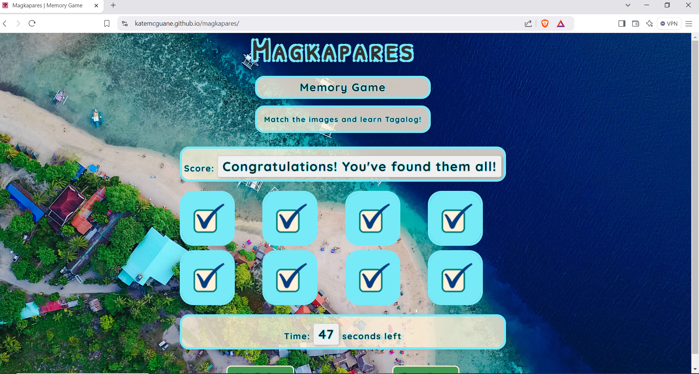
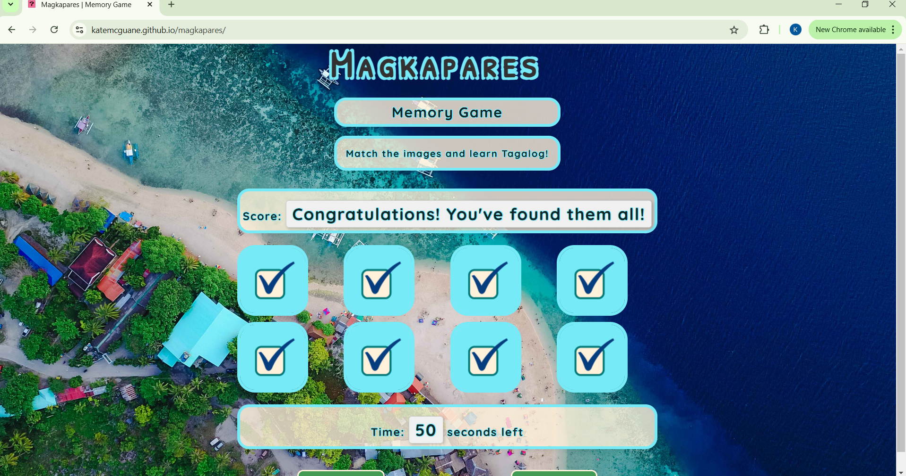
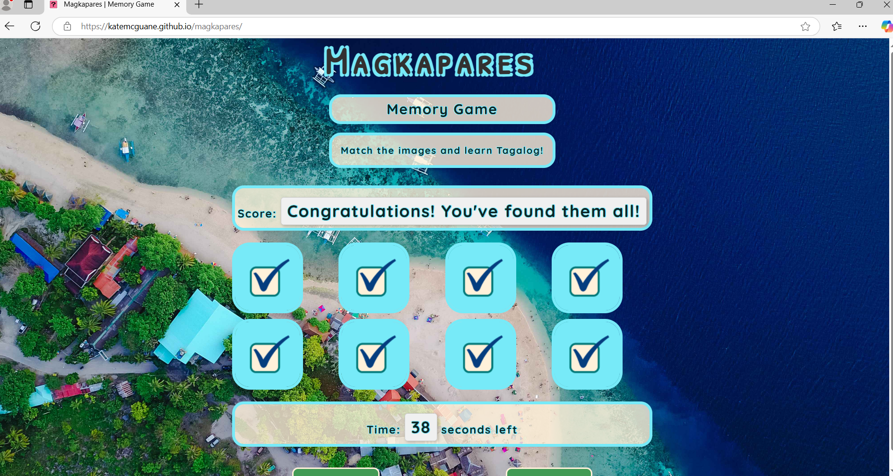
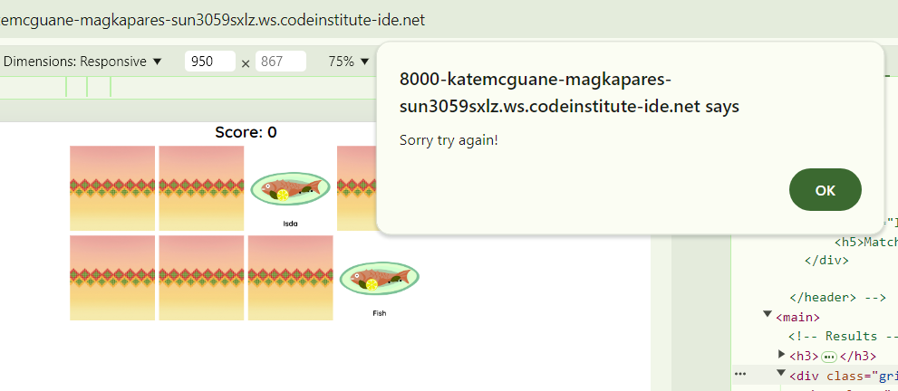
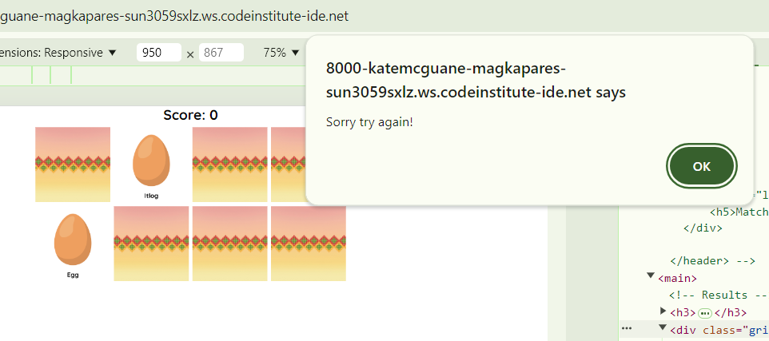
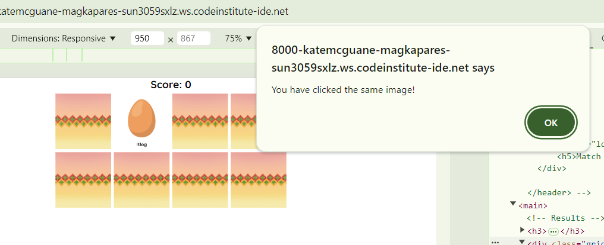
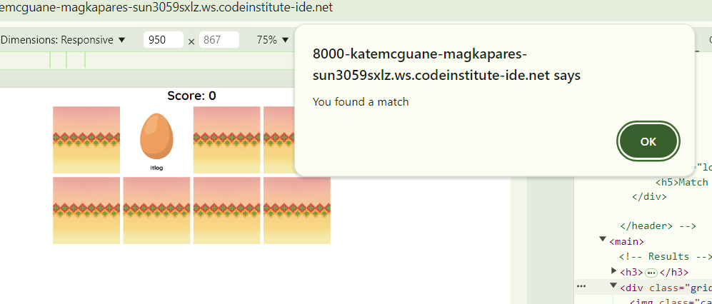
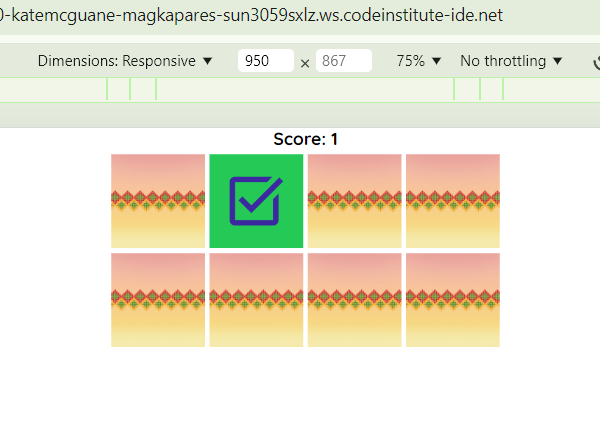
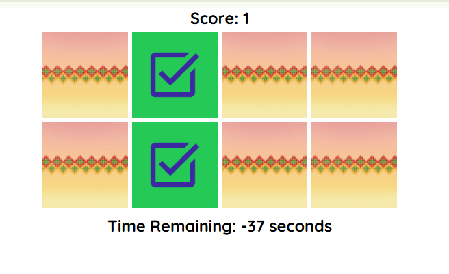
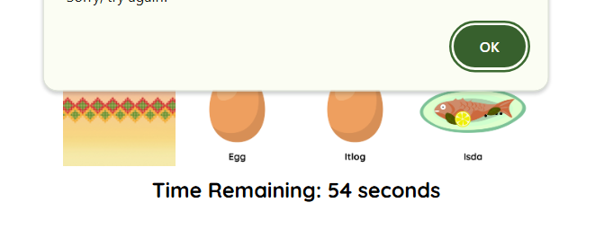

# Magkapares - Testing

Visit the deployed site [Magkapares](https://katemcguane.github.io/magkapares/) here.

---

## Compatability

The website was tested on three different browsers: Brave, Chrome, & Microsoft Edge. It was compatable across all three.

  ### Brave
  

  ### Chrome
  

  ### Microsoft Edge
  

---

## Responsiveness

The website was tested manually throughout the project development using DevTools to check for responsiveness.

The responsiveness was confirmed with [Responsive Website Design Tester](https://responsivedesignchecker.com/). The following are samples of some of the responsiveness implemented.

  ### Desktop Screens
  

  ### Tablet Screens
  

  ### Mobile Screens
  

---

### Validator Testing

#### HTML
  No errors were returned when passing through the official [W3C validator](https://validator.w3.org/nu/)
  (INSERT_GIF_FILE_HERE)

#### CSS
  No errors were found when passing through the official [(Jigsaw) validator](https://jigsaw.w3.org/css-validator/)
  (INSERT_GIF_FILE_HERE)

#### JavaScript
  No errors were found when passing through the official [Jshint validator](https://jshint.com/)
  (INSERT_GIF_FILE_HERE)

---

## LightHouse report

I used Lighthouse in DevTools to confirm that the website is performing well, accessiblility and readability of fonts & colours. Testing was done for both mobile & desktop.

  #### Desktop
  
  #### Mobile
  

DUPLICATE THE ABOVE & LABEL FOR ANY EXTRA PAGES CREATED.

---

## Bugs

  ### Solved Bugs

  | # | Bug | How I solved the issue | Screenshots |
  | --- | --- | --- | --- |
  | 1 | Matching cards not registering. This applies to all types of pairs.  | Reviewed the code, and found mis-match in some of the naming used. The code was not being commanded correctly & therefore could not execute. |    |
  | 2 | When the same image is clicked twice, it is registering as a matched pair. Furthermore, when this registered as a matched pair, the image changes. | --- |    |
  | 3 | The timer starts as normal when the first card is clicked. Two bugs occur: (i) Any clicks thereafter encourages the timer to countdown even faster. It duplicates the current countdown speed for every card clicked.   (ii) Once the timer surpasses the allocated 60 seconds, it runs on into minus figures. | Code refactored:   (i) Moved the startCountdown function inside conditional block to ensure it is only triggered once, on the first card flip.  (ii) Implement endGame function fully & create new variable to track that the timer has started. |  |
  | 4 | If clicked in quick succession, the player can click more than two cards on any given turn. Up to 5 cards can be clicked in between the first and second selection. Not all of the cards selected turn around, and remain revealed to the player.| Add a check in the flipCard() function to see if there are already two cards flipped. This will prevent further clicks from triggering a flip until the current two cards are checked. |  |

  - Once all of the solutions were carried out, I reviewed each issue to ensure all corrections were applied & no further major issues were occurring.

  ### Known Bugs

  | # | Bug | Cause | Screenshots |
  | 1 | Spacing between the cards changes when the game is won | This is a minor issue being caused by the span adjusting in size above the cards. Most of the game was made at this point. It does not affect the game's functionality or warrant a complete overhaul as it is a minor inconveniece to UX. This can be adjusted on future iterations. | ![Game Won Spacing] |
  | 2 | --- | --- | --- |
